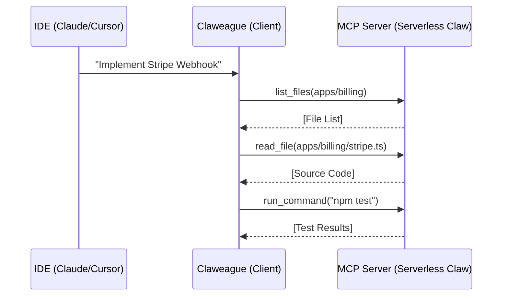

# Technical: The MCP Handshake—Talking to Your Code Substrate

> To work with a **Claweague**, you need a common language. That language is the **Model Context Protocol (MCP)**.

---

## Beyond the Clipboard

The "Clipboard Anti-pattern"—copying code from an IDE to a chat window and back—is exactly where agentic productivity dies.

A **Claweague** doesn't use a clipboard. It uses a persistent, high-bandwidth connection to your codebase via an MCP server.

## What is MCP?

Developed by Anthropic and adopted by the AIReady ecosystem, MCP allows your AI agent (the Client) to interact with localized "Tools" (the Server).

For a **Claweague**, the MCP server provides:

1. **File System Access**: Read/write capabilities within the repository.
2. **Terminal Execution**: The ability to run tests, build scripts, and linting.
3. **Semantic Search**: Vector-based indexing of your entire codebase context.

### The Connection Flow:



## Setting up your Handshake

Connecting your project to a Claweague is simple. Add the following to your MCP configuration:

```json
{
  "mcpServers": {
    "claweague": {
      "command": "npx",
      "args": ["-y", "@aiready/mcp-server", "--project", "./"]
    }
  }
}
```

## Why this Matters

This handshake allows your colleague to treat your code as its **Cognitive Substrate**. It doesn't just "see" the code; it can "touch" and "mutate" it. This is the difference between a consultant who talks and a teammate who codes.

---

_In Part 3, we look at **Teaching Your Claw New Skills**._
